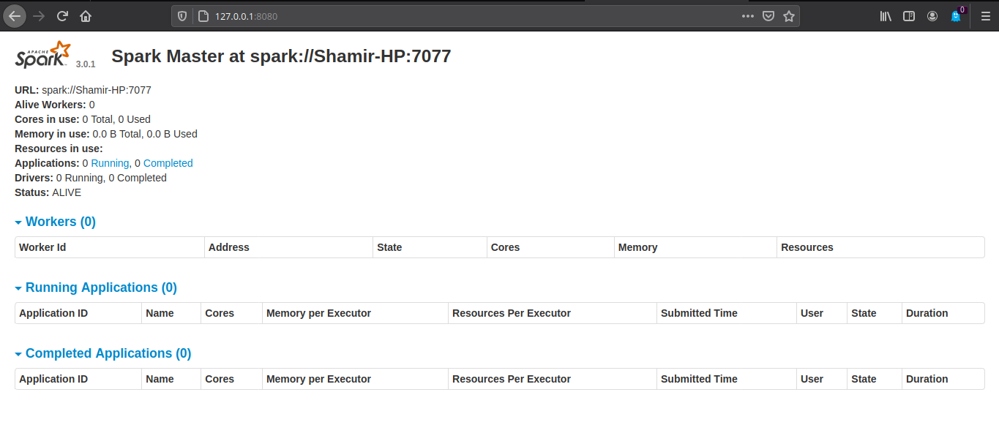

# Getting Started with Spark


## Sections

1. [Installing Spark Dependencies](#section1)
2. [Starting Spark](#section2)
---

## <a id="section1" ></a> 1. Installing Spark Dependencies
- Install JDK, Scala and Git
    ```
    sudo apt install default-jdk scala git -y
    ```
- Once Installed, verify the installed dependies
   ```
   java -version; javac -version; scala -version; git --version
   ```
- Downlod Spark with Hadoop using wget
    ```
    wget https://downloads.apache.org/spark/spark-3.0.1/spark-3.0.1-bin-hadoop2.7.tgz
    ```
- Extract the saved file
    ```
    tar xvf spark-*
    ```
- Use Echo commands to add three lines to .profile. Make sure the commands are added in the .profile in the home directory (if not done, the spark commands will not work from the terminal as source is not defined).
    ```
    echo "export SPARK_HOME=/opt/spark" >> ~/.profile
    echo "export PATH=$PATH:$SPARK_HOME/bin:$SPARK_HOME/sbin" >> ~/.profile
    echo "export PYSPARK_PYTHON=/usr/bin/python3" >> ~/.profile
    ```
- After Loading Profile
    ```
    source ~/.profile
    ```

## <a id="section2" ></a>2. Starting Spark
- Start Master Server
    ```
    start-master.sh
    ```
- To view the Spark Web user interface, open a web browser and enter the localhost IP address on port 8080.
    ```
    http://127.0.0.1:8080/
     ```
    
- Start Slave Server
  ```
  start-slave.sh spark://master:port
  ```
  In our case:
  ```
  start-slave.sh spark://Shamir-HP:7077
  ```
- To stop a server
  ```
  stop-master.sh
  ```
- To stop a slave
    ```
    stop-slave.sh
    ```
## Reference
1. https://phoenixnap.com/kb/install-spark-on-ubuntu